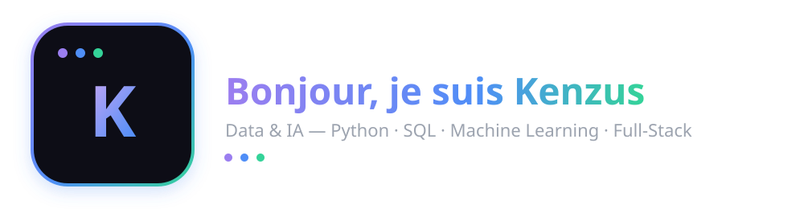

 

<!-- ================= A PROPOS ================= -->

&nbsp;
## &nbsp;A propos de moi

- Je travaille actuellement sur : ...
- J'apprends en ce moment : ...
- Je cherche a collaborer sur : ...
- Demandez-moi a propos de : ...
- Comment me contacter : ...

 

<!-- ================= COMPETENCES ================= -->

&nbsp;
## &nbsp;Mes competences

 

<!-- 

 -->

 

<!-- ================= ANIMATION TEXTE ================= -->

 

<!-- ================= STATS GITHUB ================= -->

&nbsp;
## &nbsp;Statistiques GitHub

 

 

<!-- ================= CONTACT ================= -->

&nbsp;
## &nbsp;Me retrouver

 

 

<!-- ================= VISITEURS ================= -->

 

