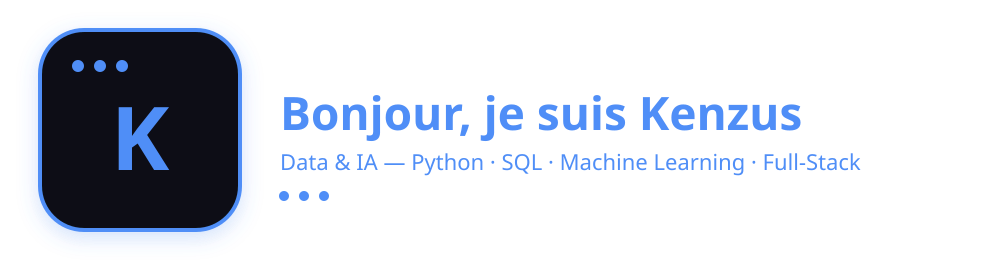

 

<!-- ================= A PROPOS ================= -->

  
  

- Je travaille actuellement sur des projets autour de la data, de l'IA et du développement web.
- J'apprends Vue, Nuxt et les bonnes pratiques full-stack pour créer des interfaces solides.
- J'aime transformer des idées utiles en produits clairs, robustes et agréables à utiliser.
- Mes sujets favoris : Python, SQL, machine learning, dashboards et automatisation.
- Tu peux me contacter pour échanger autour d'un projet, d'une idée ou d'une collaboration.

 

<!-- ================= COMPETENCES ================= -->

  
  

 

<!-- ================= ANIMATION TEXTE ================= -->

 

<!-- ================= STATS GITHUB ================= -->

  
  

 

<!-- ================= CONTACT ================= -->

  
  

 

<!-- ================= VISITEURS ================= -->

 

